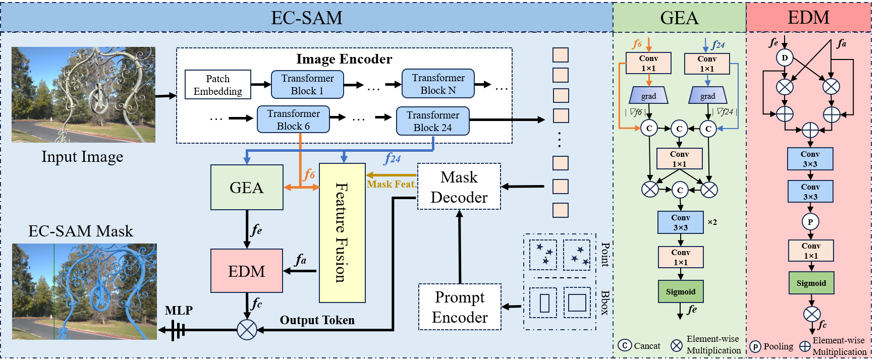
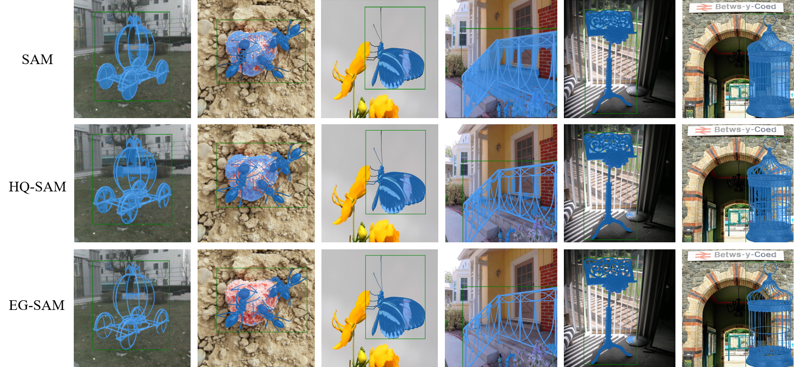
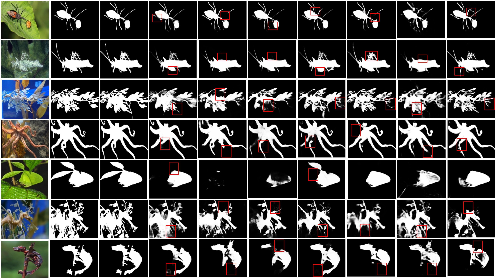
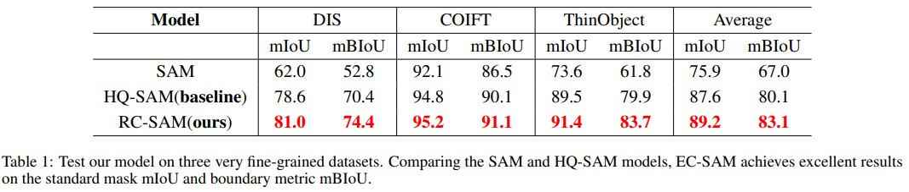
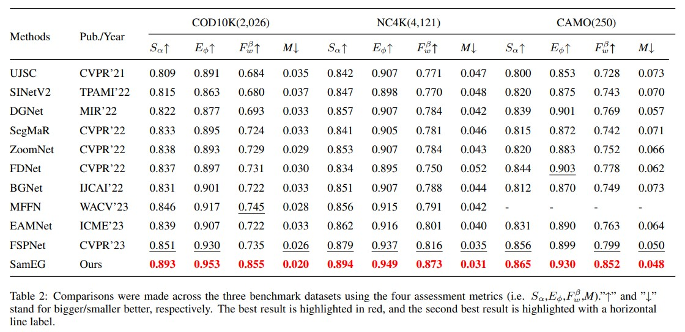

## EG-SAM: An Edge-Guided SAM for Accurate Complex Object Segmentation

### Pipeline



### Environment

Python 3.8

CUDA 11.7

PyTorch 1.13.1

TorchVision 0.14.1

### Datasets
We follow the data set structure of HQSeg-44K as follows：
```
data
|____DIS5K
|____cascade_psp
| |____DUTS-TE
| |____DUTS-TR
| |____ecssd
| |____fss_all
| |____MSRA_10K
|____thin_object_detection
| |____COIFT
| |____ThinObject5K
```
You can get the datasets from [here](https://drive.google.com/drive/folders/1j1yFEejTAdAQzSbCrdBWoHE4VjaAf25L?usp=drive_link)
### Train
```
python -m torch.distributed.launch --nproc_per_node=<num_gpus> train.py --checkpoint <your checkpoint path> --model-type <model_type> --output <your output path>
```

EG-SAM is an improvement on the basis of HQ-SAM, you can follow the environment Settings [here](https://github.com/SysCV/SAM-HQ?tab=readme-ov-file)
### Evaluation
```
python -m torch.distributed.launch --nproc_per_node=<num_gpus> train.py --checkpoint <your checkpoint path> --model-type <model_type> --output <your output path> --eval --restore-model <your training_checkpoint path>
```
You can get the weight file [here](https://drive.google.com/file/d/1B9-bTQ4c_fG8s--837HpMhaUT5gWGdv9/view?usp=drive_link)

### Visualization



Visual comparison with **nine state-of-the-art COD methods**. EG-SAM demonstrates superior accuracy in delineating the boundaries of camouflaged objects.




### Results on DIS，COIFT and ThinObject



### Results on CODs



